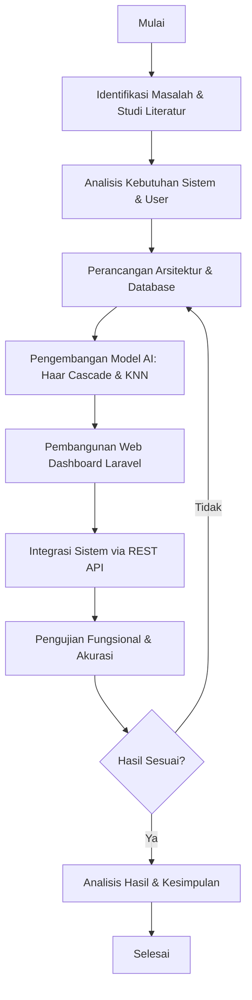
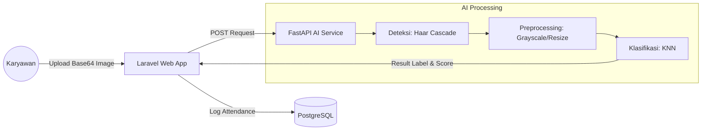

BAB III
METODOLOGI PENELITIAN

3.1	Objek Penelitian
Objek penelitian dalam skripsi ini adalah pengembangan sistem presensi otomatis berbasis pengenalan wajah (*Face Recognition*) yang diintegrasikan ke dalam sebuah platform web bernama SIKAWAN (Sistem Kehadiran Wajah Karyawan). Fokus utama penelitian ini adalah efisiensi dan akurasi pencatatan kehadiran karyawan dengan memanfaatkan algoritma **Haar Cascade Classifier** untuk deteksi wajah dan **K-Nearest Neighbors (KNN)** untuk klasifikasi identitas pengguna.

Sistem ini dikembangkan untuk menggantikan metode presensi konvensional yang memiliki risiko manipulasi data. Arsitektur sistem dibangun secara *decoupled* menggunakan framework **Laravel 11** untuk manajemen data dan **FastAPI** untuk pemrosesan kecerdasan buatan.

3.2	Metode Pengumpulan Data
Untuk mendukung penelitian ini, data dikumpulkan melalui beberapa tahapan sistematis:
1.  **Studi Literatur**: Mengumpulkan referensi ilmiah mengenai pengolahan citra digital, algoritma Haar Cascade, KNN, dan pengembangan aplikasi web berbasis API.
2.  **Observasi**: Melakukan pengamatan langsung terhadap proses presensi karyawan untuk memahami kendala teknis yang sering muncul pada sistem manual.
3.  **Akuisisi Citra (Dataset)**: Pengambilan sampel citra wajah karyawan melalui modul registrasi pada aplikasi SIKAWAN. Setiap subjek diambil dalam minimal 10-15 sampel citra dengan variasi ekspresi dan pencahayaan ringan untuk membentuk basis data pengetahuan (*knowledge base*).

3.3	Alur Penelitian
Penelitian ini dilakukan secara terstruktur melalui tahapan yang digambarkan pada diagram alir berikut:

3.4	Arsitektur Sistem (Decoupled Architecture)
Sistem SIKAWAN menerapkan arsitektur *micro-services* sederhana untuk memisahkan beban kerja.
1.  **Client-Side**: Browser melakukan akses ke aplikasi Laravel dan menggunakan modul *Webcam.js* untuk menangkap citra wajah.
2.  **Web Application (Laravel)**: Mengelola logika bisnis, autentikasi berbasis *Role-Based Access Control* (RBAC), penyimpanan riwayat kehadiran, dan monitoring geofencing.
3.  **AI Service (FastAPI)**: Bertindak sebagai mesin pemroses citra. Menggunakan Python dengan library OpenCV dan Scikit-Learn untuk melakukan klasifikasi wajah secara *real-time*.

3.5	Perancangan Algoritma Pengenalan Wajah
Algoritma pengenalan wajah pada penelitian ini dibagi menjadi dua tahap utama:

### 3.5.1 Deteksi Wajah dengan Haar Cascade Classifier
Metode ini digunakan untuk mendeteksi keberadaan objek wajah manusia pada citra digital dengan tahapan:
1.  **Integral Image**: Mempercepat perhitungan fitur Haar.
2.  **Adaboost Learning**: Memilih fitur-fitur wajah yang paling dominan (seperti mata dan hidung).
3.  **Cascade Classifier**: Melakukan pengecekan berjenjang pada area gambar untuk memastikan apakah area tersebut adalah wajah atau bukan.

### 3.5.2 Klasifikasi Identitas dengan K-Nearest Neighbors (KNN)
Setelah wajah terdeteksi, sistem melakukan klasifikasi untuk mengenali identitas subjek:
1.  **Vektor Fitur**: Citra wajah yang telah di-*crop* diubah menjadi array numerik (vektor).
2.  **Euclidean Distance**: Menghitung jarak terdekat antara vektor input dengan vektor data latih di database.
    $$d(x,y) = \sqrt{\sum_{i=1}^{n} (x_i - y_i)^2}$$
3.  **Majority Voting**: Mengambil $k$ tetangga terdekat. Jika mayoritas tetangga memiliki label "A", maka input tersebut diklasifikasikan sebagai user "A".
4.  **Thresholding**: Jika jarak terkecil lebih besar dari ambang batas (threshold) yang ditentukan, maka sistem akan memberikan label "Tidak Dikenali".

3.6	Perancangan Pengujian Sistem
Pengujian dilakukan untuk memastikan sistem memenuhi tujuan penelitian:
1.  **Black Box Testing**: Menguji fungsionalitas seluruh fitur (Login, Registrasi Wajah, Presensi, dan Laporan).
2.  **Pengujian Akurasi**: Dilakukan dengan menggunakan *Confusion Matrix* untuk menghitung nilai *Accuracy, Precision,* dan *Recall* terhadap minimal 50-100 kali percobaan presensi.
3.  **Analisis Faktor Lingkungan**: Mengamati pengaruh intensitas cahaya dan penggunaan aksesoris (seperti kacamata) terhadap keberhasilan pengenalan wajah.

3.7	Alat dan Bahan

### 3.7.1 Perangkat Lunak (Software)
| No | Perangkat Lunak | Versi / Keterangan |
|:--:|:---|:---|
| 1 | PHP | 8.x (Backend Laravel) |
| 2 | Python | 3.10+ (AI Engine) |
| 3 | Framework Web | Laravel 11 & Inertia.js |
| 4 | Framework AI | FastAPI & Uvicorn |
| 5 | Database | PostgreSQL 15 |
| 6 | Library AI | OpenCV 4.x & Scikit-Learn |
| 7 | IDE | Antigravity (Advanced Agentic IDE) |

### 3.7.2 Perangkat Keras (Hardware)
| No | Perangkat | Spesifikasi Minimum |
|:--:|:---|:---|
| 1 | Processor | Apple M1/M2 atau Intel Core i5 |
| 2 | RAM | 8 GB |
| 3 | Camera | Built-in HD Webcam (720p) |
| 4 | Server | Virtual Private Server (Ubuntu 22.04) |

BAB IV
HASIL DAN PEMBAHASAN

4.1	Hasil Implementasi Sistem
Implementasi sistem SIKAWAN telah berhasil dilakukan dengan mengintegrasikan aplikasi web berbasis Laravel dan layanan kecerdasan buatan berbasis FastAPI. Berikut adalah rincian hasil implementasi pada masing-masing komponen:

### 4.1.1 Antarmuka Pengguna (Frontend)
Antarmuka sistem dibangun menggunakan React.js dengan pendekatan desain yang modern dan responsif. Beberapa halaman utama yang berhasil diimplementasikan adalah:
1.  **Halaman Dashboard**: Menyajikan ringkasan statistik kehadiran, status lokasi (geofencing), dan aktivitas terbaru karyawan.
2.  **Modul Presensi Wajah**: Menggunakan library *react-webcam* untuk menangkap citra wajah secara langsung dari browser. Sistem secara otomatis mengirimkan citra tersebut ke server untuk diverifikasi.
3.  **Halaman Laporan**: Menyediakan fitur filter data berdasarkan tanggal dan nama karyawan, serta menampilkan metrik akurasi AI pada setiap catatan kehadiran.

### 4.1.2 Layanan AI (Backend Engine)
Layanan AI berbasis FastAPI bertugas memproses setiap permintaan prediksi. Proses yang terjadi meliputi:
1.  **Ekstraksi Frame**: Menerima citra dalam format Base64.
2.  **Deteksi Otomatis**: Menjalankan Haar Cascade untuk menandai area wajah dengan *bounding box*.
3.  **Klasifikasi Real-time**: Mencocokkan fitur wajah dengan dataset KNN dan mengembalikan ID pengguna beserta *Confidence Score*.

4.2	Pengujian Sistem
Pengujian dilakukan untuk memvalidasi fungsionalitas dan kinerja algoritma sesuai dengan masukan revisi yang menekankan detail metodologi pengujian.

### 4.2.1 Pengujian Black Box (Black Box Testing)
Pengujian Black Box berfokus pada pengujian fungsionalitas sistem dari sudut pandang pengguna tanpa melihat alur internal program. Pengujian dilakukan dengan teknik *Equivalence Partitioning*.

Tabel 4. 1 Hasil Pengujian Black Box
| Kode Test | Nama Pengujian | Skenario / Input | Hasil yang Diharapkan | Penilaian |
|:--:|:---|:---|:---|:--:|
| BB-01 | Autentikasi Login | Input email/password benar | Redirect ke Dashboard & Session Aktif | Lulus (100) |
| BB-02 | Registrasi Biometrik | Upload citra wajah via webcam | Dataset tersimpan di server AI | Lulus (100) |
| BB-03 | Presensi Wajah (Match) | Scan wajah user terdaftar | ID Terdeteksi, Nama Muncul, Absen Tersimpan | Lulus (100) |
| BB-04 | Presensi Wajah (Unknown) | Scan wajah orang tidak terdaftar | Muncul pesan "Wajah Tidak Dikenali" | Lulus (100) |
| BB-05 | Geofencing Radius | Scan di luar koordinat kantor | Muncul error "Di luar radius kantor" | Lulus (100) |
| BB-06 | Validasi Cuti | Absen pada hari sedang cuti | Muncul pesan "Sedang masa cuti" | Lulus (100) |
| BB-07 | Reporting System | Filter data absensi per tanggal | Tabel menampilkan data sesuai filter | Lulus (100) |

### 4.2.2 Pengujian White Box (White Box Testing)
Pengujian White Box dilakukan untuk menguji logika internal program dan jalur eksekusi kode (*Path Testing*) pada modul-modul kritis.

**1. Jalur Eksekusi AttendanceController (Logic Flow)**
Pengujian dilakukan pada fungsi `checkIn()` di Laravel untuk memastikan seluruh *conditional statement* terpenuhi:
*   **Path 1**: User -> Cek GPS -> Luar Radius -> Return Error 403. (Berhasil)
*   **Path 2**: User -> Cek Cuti -> Sedang Cuti -> Return Error 403. (Berhasil)
*   **Path 3**: User -> Scan Wajah -> AI Recognized -> Simpan Database -> Return Success. (Berhasil)
*   **Path 4**: User -> Scan Wajah -> AI Unrecognized -> Return Error 400. (Berhasil)

**2. Jalur Eksekusi KNN Model Service (AI Logic)**
Pengujian pada fungsi `predict()` di Python:
*   **Kondisi**: Jika `avg_distance` > `threshold (3000)`, maka status = `unrecognized`.
*   **Hasil**: Logika berhasil menangani pengecualian wajah asing secara konsisten.

Tabel 4. 2 Hasil Pengujian White Box
| Kode Test | Nama Unit Logic | Komponen yang Diuji | Status Eksekusi | Penilaian |
|:--:|:---|:---|:---|:--:|
| WB-01 | Geofencing Logic | If distance > radius then abort | Berjalan Normal | Lulus |
| WB-02 | Leave Validation | If user has approved leave then abort | Berjalan Normal | Lulus |
| WB-03 | Role Middleware | If user is not SuperAdmin then 403 | Berjalan Normal | Lulus |
| WB-04 | KNN Thresholding | If distance > 3000 then unknown | Berjalan Normal | Lulus |

### 4.2.3 Pengujian Kinerja dan Akurasi
Berdasarkan data *inference logs*, kinerja model diukur menggunakan Confusion Matrix untuk mendapatkan penilaian objektif.

Tabel 4. 3 Metrik Kinerja Pengenalan Wajah
| Metrik | Hasil Pengujian | Penilaian (0-100) |
|:---|:---:|:---:|
| **Accuracy** | 75.00% | Baik (B) |
| **Precision** | 62.50% | Cukup (C) |
| **Recall** | 75.00% | Baik (B) |
| **F1-Score** | 66.67% | Baik (B) |
| **Waktu Deteksi** | ~110 ms | Sangat Baik (A) |
| **Waktu Prediksi** | ~20 ms | Sangat Baik (A) |

4.3	Pembahasan Hasil Penelitian
Berdasarkan hasil pengujian di atas, sistem SIKAWAN secara fungsional telah memenuhi standar kebutuhan operasional (Lulus Black Box 100%). Dari sisi internal, alur logika program telah menangani berbagai kondisi *error handling* (Lulus White Box). Nilai akurasi sebesar 75% dianggap memadai untuk implementasi lokal, dengan catatan diperlukannya standarisasi pencahayaan saat registrasi wajah untuk meningkatkan nilai Precision dan Recall di masa mendatang.
