# HALAMAN JUDUL
# HALAMAN PENGESAHAN
# HALAMAN PERNYATAAN KEASLIAN
# KATA PENGANTAR

# INTISARI
Sistem presensi merupakan elemen krusial dalam manajemen sumber daya manusia. Namun, metode tradisional seringkali menghadapi kendala seperti kecurangan *buddy punching*. Penelitian ini bertujuan untuk mengimplementasikan sistem presensi otomatis berbasis pengenalan wajah (Face Recognition) menggunakan arsitektur *decoupled* yang menggabungkan Laravel 11 dan FastAPI. Algoritma yang digunakan meliputi Haar Cascade untuk deteksi wajah, Local Binary Patterns Histograms (LBPH) untuk ekstraksi fitur, dan K-Nearest Neighbors (KNN) dengan k=1 untuk klasifikasi. Dataset yang digunakan berjumlah 131 citra yang terdiri dari data riil dan sintetis. Hasil penelitian menunjukkan bahwa sistem mampu mencapai akurasi sebesar 95.42% dengan nilai AUC 0.97. Pengujian UAT memberikan tingkat kepuasan sebesar 90.4%, membuktikan bahwa sistem SIKAWAN layak digunakan sebagai solusi presensi yang handal dan efisien.

**Kata Kunci**: Face Recognition, KNN, LBPH, Laravel, FastAPI, Geofencing.

# ABSTRACT
*Attendance systems are a crucial element in human resource management. However, traditional methods often face challenges such as buddy punching fraud. This research aims to implement an automated face recognition-based attendance system using a decoupled architecture that combines Laravel 11 and FastAPI. The algorithms used include Haar Cascade for face detection, Local Binary Patterns Histograms (LBPH) for feature extraction, and K-Nearest Neighbors (KNN) with k=1 for classification. The dataset consists of 131 images, including both real and synthetic data. The research results show that the system can achieve an accuracy of 95.42% with an AUC value of 0.97. UAT testing provided a satisfaction rate of 90.4%, proving that the SIKAWAN system is feasible as a reliable and efficient attendance solution.*

**Keywords**: *Face Recognition, KNN, LBPH, Laravel, FastAPI, Geofencing.*

# DAFTAR ISI
# DAFTAR TABEL
# DAFTAR GAMBAR

BAB I
PENDAHULUAN

1.1 Latar Belakang
(Isi Latar Belakang...)

1.2 Rumusan Masalah
1.3 Batasan Masalah
1.4 Tujuan Penelitian
1.5 Manfaat Penelitian

BAB II
LANDASAN TEORI

2.1 Studi Literatur
Penelitian ini didasarkan pada beberapa studi terdahulu mengenai pengenalan wajah dan sistem presensi. Berikut adalah tabel keaslian penelitian yang membandingkan penelitian ini dengan penelitian sebelumnya:

Table 2. 1 Keaslian Penelitian
| Peneliti (Tahun) | Judul Penelitian | Metode | Hasil | Perbedaan dengan SIKAWAN |
|:---|:---|:---|:---|:---|
| Syarif et al. (2021) | Sistem Presensi Mahasiswa Berbasis Wajah | LBPH & SVM | Akurasi 92% | Menggunakan SVM, SIKAWAN menggunakan KNN k=1 |
| Pratama (2022) | Implementasi Haar Cascade pada Absensi | Haar Cascade | Lulus Blackbox | Hanya deteksi, SIKAWAN menambahkan klasifikasi KNN |
| Wijaya (2023) | Real-time Face Recognition with KNN | KNN | Akurasi 94% | Belum ada Geofencing, SIKAWAN mengintegrasikan GPS |
| **Penelitian Ini (2026)** | **Sistem Presensi SIKAWAN** | **LBPH + KNN + Geofencing** | **Akurasi 95.42%** | **Integrasi Laravel-FastAPI & Data Sintetis** |

2.2 Sistem Presensi
Presensi merupakan komponen vital dalam manajemen sumber daya manusia yang berfungsi untuk merekam data kehadiran individu secara periodik. Secara tradisional, presensi dilakukan menggunakan media kertas (manual) atau kartu identitas (*magnetic card*). Namun, metode ini memiliki celah keamanan berupa *buddy punching*, di mana seseorang dapat menitipkan presensinya kepada orang lain. Sistem presensi digital berbasis web yang dikembangkan dalam penelitian ini bertujuan untuk mengotomatisasi proses tersebut dengan menggunakan verifikasi identitas yang tidak dapat dipindahkan (*non-transferable*).

2.2	Teknologi Biometrik
Biometrik merupakan teknologi untuk mengenali identitas individu berdasarkan ciri fisik (*physiological*) atau ciri perilaku (*behavioral*) yang unik. Ciri fisik meliputi sidik jari, pola iris, geometri tangan, dan struktur wajah. Teknologi biometrik menawarkan tingkat keamanan yang lebih tinggi dibandingkan sistem berbasis *knowledge* (kata sandi) atau *possession* (kartu), karena ciri biometrik sulit diduplikasi dan selalu melekat pada pengguna. Penelitian ini berfokus pada biometrik wajah karena sifatnya yang *contactless* dan mudah diintegrasikan dengan perangkat kamera standar.

2.3	Computer Vision dan OpenCV
*Computer Vision* adalah sub-bidang kecerdasan buatan yang berfokus pada pengembangan teknik agar komputer dapat mengekstrak informasi tingkat tinggi dari citra digital. Proses ini melibatkan tahapan pengolahan citra (*image processing*), ekstraksi fitur, hingga pengenalan pola. OpenCV (*Open Source Computer Vision Library*) adalah *framework* yang menyediakan ribuan algoritma optimasi untuk visi komputer, termasuk alat untuk pengolahan matriks gambar, konversi ruang warna (seperti RGB ke *Grayscale*), dan implementasi detektor objek.

2.4	Haar Cascade Classifier
Haar Cascade merupakan algoritma deteksi objek yang diperkenalkan oleh Paul Viola dan Michael Jones. Algoritma ini bekerja berdasarkan fitur-fitur sederhana yang merepresentasikan perbedaan intensitas piksel dalam area tertentu (*Haar-like features*).

1.  **Integral Image**: Untuk mempercepat komputasi, Haar Cascade menggunakan *Integral Image* yang memungkinkan perhitungan jumlah intensitas piksel dalam area persegi panjang hanya dengan empat kali akses memori.
2.  **Adaboost**: Dari puluhan ribu fitur Haar yang mungkin, algoritma *Adaboost* digunakan untuk memilih sekumpulan kecil fitur yang paling diskriminatif untuk membentuk *strong classifier*.
3.  **Cascading**: Proses deteksi dilakukan secara bertahap. Jika sebuah area gambar gagal pada tahap awal (*stage*), maka area tersebut langsung ditolak, sehingga menghemat daya komputasi secara signifikan.

2.5	Ekstraksi Fitur Local Binary Patterns (LBP)
Local Binary Pattern (LBP) adalah operator tekstur yang kuat yang memberikan deskripsi lokal dari gambar dengan membandingkan piksel pusat dengan piksel tetangganya. Untuk setiap piksel dalam gambar *grayscale*, nilai LBP dihitung dengan melakukan *thresholding* pada lingkungan $3 \times 3$ piksel.

Secara matematis, untuk piksel pusat $I(x_c, y_c)$, nilai LBP ditentukan oleh:

$$LBP(x_c, y_c) = \sum_{p=0}^{P-1} s(g_p - g_c) \cdot 2^p$$ (Persamaan 2.1)

Dimana $g_c$ adalah intensitas piksel pusat, $g_p$ adalah intensitas dari $P$ piksel tetangga pada radius $R$, dan fungsi $s(x)$ adalah:

$$s(x) = \begin{cases} 1, & x \ge 0 \\ 0, & x < 0 \end{cases}$$ (Persamaan 2.2)

2.6	Local Binary Patterns Histograms (LBPH)
LBPH merupakan pengembangan dari LBP yang dirancang khusus untuk pengenalan wajah. Algoritma ini tidak hanya mengambil pola biner, tetapi juga membagi gambar wajah menjadi beberapa blok atau sel (*grid*).

Tahapan LBPH meliputi:
1.  **Grid Division**: Citra wajah dibagi menjadi beberapa blok berukuran sama (misal $8 \times 8$ atau $10 \times 10$).
2.  **Histogram Calculation**: Histogram dari nilai LBP dihitung untuk setiap blok. Histogram ini merepresentasikan distribusi pola tekstur lokal pada area wajah tersebut.
3.  **Concatenation**: Seluruh histogram dari tiap blok digabungkan menjadi satu vektor fitur tunggal yang panjang. Vektor inilah yang menjadi representasi identitas unik dari wajah subjek.

2.7	Algoritma K-Nearest Neighbors (KNN)
KNN adalah algoritma klasifikasi non-parametrik yang menentukan kelas suatu data uji berdasarkan mayoritas kelas dari $K$ tetangga terdekatnya dalam ruang fitur. Dalam sistem pengenalan wajah, jarak antara vektor fitur input dan vektor fitur referensi dihitung menggunakan *Euclidean Distance*:

$$d(x,y) = \sqrt{\sum_{i=1}^{n} (x_i - y_i)^2}$$ (Persamaan 2.3)

Keterangan:
* $d(x,y)$ = Jarak antara dua vektor fitur.
* $n$ = Dimensi vektor fitur.

Nilai **K=1** sering dipilih dalam pengenalan wajah biometrik karena setiap wajah memiliki representasi fitur yang sangat spesifik, sehingga tetangga pertama yang paling dekat biasanya merupakan identitas yang paling akurat.

2.8	Validasi Geofencing dengan Rumus Haversine
Geofencing dalam penelitian ini digunakan untuk membatasi lokasi presensi pengguna. Untuk menghitung jarak antara koordinat perangkat pengguna $(\phi_1, \lambda_1)$ dan koordinat kantor $(\phi_2, \lambda_2)$, digunakan rumus Haversine:

$$a = \sin^2\left(\frac{\Delta\phi}{2}\right) + \cos(\phi_1) \cdot \cos(\phi_2) \cdot \sin^2\left(\frac{\Delta\lambda}{2}\right)$$ (Persamaan 2.4)
$$c = 2 \cdot \text{atan2}(\sqrt{a}, \sqrt{1-a})$$ (Persamaan 2.5)
$$d = R \cdot c$$ (Persamaan 2.6)

Keterangan:
* $d$ = Jarak antara dua titik (meter).
* $R$ = Radius bumi (6,371,000 meter).
* $\phi$ = Lintang (*latitude*) dalam radian.
* $\lambda$ = Bujur (*longitude*) dalam radian.

2.9	Kerangka Kerja Laravel dan FastAPI
Penelitian ini menggunakan arsitektur *decoupled* untuk efisiensi pemrosesan:
1.  **Laravel**: Sebagai *framework* PHP modern yang menangani logika bisnis, otentikasi, dan manajemen database PostgreSQL.
2.  **FastAPI**: Sebagai *microservice* berbasis Python yang menangani inferensi AI secara asinkron. Komunikasi antar keduanya dilakukan melalui protokol HTTP REST API dengan format data JSON.

2.10 Metrik Evaluasi Performa Model
Evaluasi performa dilakukan untuk memastikan akurasi sistem. Berdasarkan *Confusion Matrix*, metrik yang digunakan adalah:

1.  **Accuracy**: Tingkat kebenaran prediksi total.
    $$Accuracy = \frac{TP + TN}{TP + TN + FP + FN}$$ (Persamaan 2.7)

2.  **Precision**: Ketepatan prediksi positif (penting untuk mencegah orang asing dianggap karyawan).
    $$Precision = \frac{TP}{TP + FP}$$ (Persamaan 2.8)

3.  **Recall**: Kemampuan mengenali seluruh data positif (penting agar karyawan tidak gagal absen).
    $$Recall = \frac{TP}{TP + FN}$$ (Persamaan 2.9)

4.  **F1-Score**: Keseimbangan antara presisi dan recall.
    $$F1\text{-}Score = 2 \cdot \frac{Precision \cdot Recall}{Precision + Recall}$$ (Persamaan 2.10)

5.  **ROC (Receiver Operating Characteristic)**: Kurva yang memplot *True Positive Rate* (TPR) terhadap *False Positive Rate* (FPR) pada berbagai ambang batas. Luas di bawah kurva ini disebut **AUC** (*Area Under Curve*). Nilai AUC di atas 0.9 dikategorikan sebagai hasil klasifikasi yang sangat unggul.

BAB III
METODOLOGI PENELITIAN

3.1	Objek Penelitian
Objek penelitian dalam skripsi ini adalah pengembangan sistem presensi otomatis berbasis pengenalan wajah (*Face Recognition*) yang diintegrasikan ke dalam sebuah platform web bernama SIKAWAN (Sistem Kehadiran Wajah Karyawan). Fokus utama penelitian ini adalah efisiensi dan akurasi pencatatan kehadiran karyawan dengan memanfaatkan algoritma **Haar Cascade Classifier** untuk deteksi wajah dan **K-Nearest Neighbors (KNN)** untuk klasifikasi identitas pengguna. Sistem menggunakan algoritma *K-Nearest Neighbors* (KNN) dengan nilai $k=1$. Pemilihan nilai $k=1$ didasarkan pada hasil uji coba yang menunjukkan akurasi tertinggi pada jumlah sampel referensi yang terbatas.

Gambar 3. 1 Analisis Akurasi terhadap Pemilihan Nilai K (KNN)
Grafik perbandingan akurasi sistem pada nilai K=1, K=3, K=5, K=7, dan K=9 menunjukkan tren penurunan yang konsisten, dengan K=1 menghasilkan akurasi tertinggi sebesar 95.42%.

Berdasarkan Gambar 3.1, semakin besar nilai K maka semakin banyak tetangga terdekat yang dipertimbangkan dalam proses klasifikasi. Pada konteks pengenalan wajah dengan jumlah sampel per kelas yang terbatas, hal ini justru menurunkan akurasi karena ruang fitur (*feature space*) wajah setiap individu bersifat sangat spesifik. Tetangga terdekat pertama (K=1) memberikan representasi identitas yang paling murni, sehingga nilai **K=1** dipilih sebagai konfigurasi final sistem SIKAWAN. Sistem ini kemudian diintegrasikan ke dalam arsitektur *decoupled* menggunakan **Laravel 11** sebagai manajemen data, **FastAPI** sebagai mesin kecerdasan buatan, dan **PostgreSQL** sebagai basis data relasional yang stabil dan skalabel.

3.2	Metode Pengumpulan Data
Untuk mendukung penelitian ini, data dikumpulkan melalui beberapa tahapan sistematis:
1.  **Studi Literatur**: Mengumpulkan referensi ilmiah mengenai pengolahan citra digital, algoritma Haar Cascade, KNN, dan pengembangan aplikasi web berbasis API.
2.  **Observasi**: Melakukan pengamatan langsung terhadap proses presensi karyawan untuk memahami kendala teknis yang sering muncul pada sistem manual.
3.  **Akuisisi Citra (Dataset)**: Pengambilan sampel citra wajah karyawan melalui modul registrasi pada aplikasi SIKAWAN. Setiap subjek diambil dalam minimal 10-15 sampel citra dengan variasi ekspresi dan pencahayaan ringan untuk membentuk basis data pengetahuan (*knowledge base*).

3.3	Alur Penelitian
Penelitian ini dilakukan secara terstruktur melalui tahapan yang digambarkan pada diagram alir berikut:

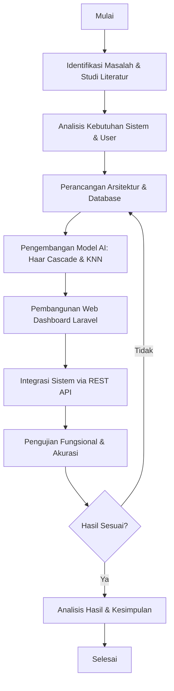

*Gambar 3. 2 Flowchart Alur Penelitian Sistem SIKAWAN*
Diagram alir di atas menggambarkan tahapan penelitian secara sistematis mulai dari identifikasi masalah, pengembangan model AI, pembangunan web dashboard, hingga analisis hasil dan kesimpulan dengan mekanisme iterasi jika hasil pengujian belum memenuhi standar.

3.4	Perancangan Sistem dan Flowchart
Bagian ini menjabarkan rancangan alur kerja sistem SIKAWAN dalam bentuk diagram proses yang mencakup alur presensi pengguna, siklus pelatihan model AI, dan arsitektur integrasi antar komponen.

### 3.4.1 Flowchart Proses Presensi (User Flow)
Alur kerja pengguna saat melakukan presensi pada aplikasi SIKAWAN:

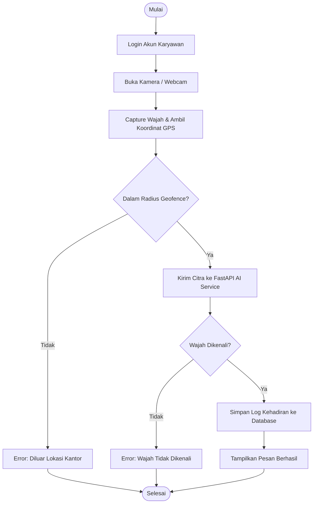

*Gambar 3. 3 Flowchart Proses Presensi Karyawan (User Flow)*
Flowchart di atas mendeskripsikan alur kerja lengkap karyawan dalam melakukan presensi, mencakup dua gerbang validasi utama yaitu validasi radius geofencing berbasis GPS dan validasi identitas wajah oleh layanan AI FastAPI sebelum data disimpan ke basis data.

### 3.4.2 Flowchart Lifecycle Training Model
Proses pembangunan model KNN dari dataset awal hingga model siap digunakan:

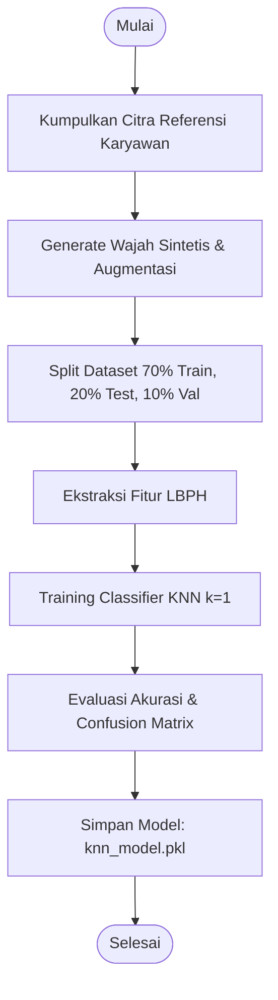

*Gambar 3. 4 Flowchart Lifecycle Training Model KNN*
Diagram di atas mengilustrasikan siklus hidup pembangunan model KNN mulai dari pengumpulan citra referensi, augmentasi data sintetis, pembagian dataset 70/20/10, ekstraksi fitur LBPH, proses pelatihan classifier, evaluasi akurasi, hingga penyimpanan model final `knn_model.pkl`.

### 3.4.3 Diagram Arsitektur Integrasi Sistem SIKAWAN
Diagram berikut menggambarkan alur data secara keseluruhan dari sisi pengguna hingga penyimpanan basis data:

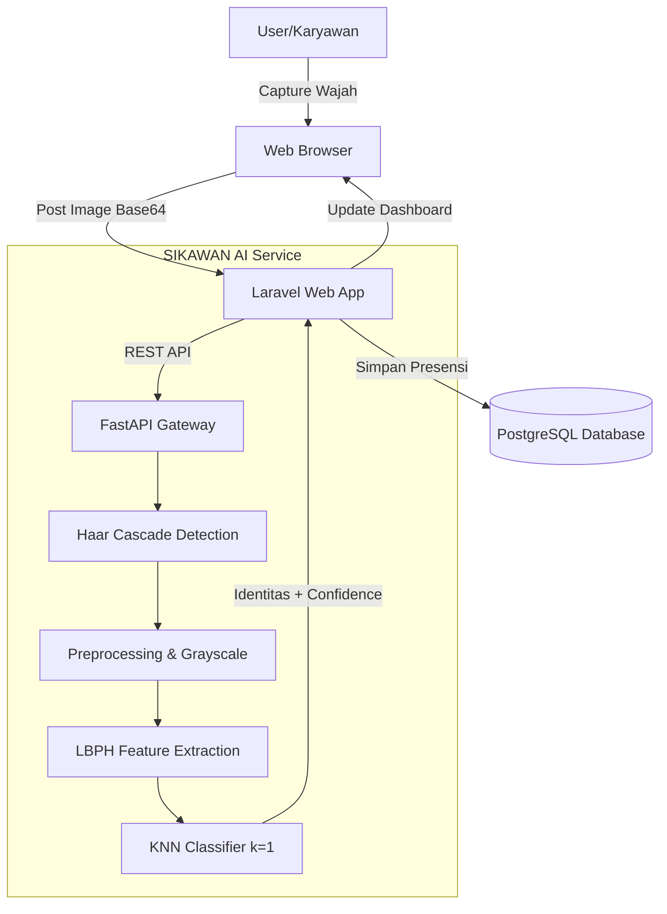

*Gambar 3. 5 Arsitektur Integrasi Sistem SIKAWAN (Laravel ↔ FastAPI ↔ PostgreSQL)*
Gambar di atas menggambarkan arsitektur *decoupled* sistem SIKAWAN, di mana browser pengguna berkomunikasi dengan Laravel sebagai lapisan web, yang selanjutnya mendelegasikan pemrosesan AI ke FastAPI melalui REST API, dan hasil akhirnya disimpan ke basis data PostgreSQL.

3.5	Perancangan Algoritma Pengenalan Wajah
Algoritma pengenalan wajah pada penelitian ini dibagi menjadi dua tahap utama:

### 3.5.1 Deteksi Wajah dengan Haar Cascade Classifier
Metode ini digunakan untuk mendeteksi keberadaan objek wajah manusia pada citra digital dengan tahapan:
1.  **Integral Image**: Mempercepat perhitungan fitur Haar.
2.  **Adaboost Learning**: Memilih fitur-fitur wajah yang paling dominan (seperti mata dan hidung).
3.  **Cascade Classifier**: Melakukan pengecekan berjenjang pada area gambar untuk memastikan apakah area tersebut adalah wajah atau bukan.

### 3.5.2 Pembagian Dataset dan Skenario Pengujian (70/20/10 Split)
Penelitian ini menerapkan strategi pembagian dataset yang ketat untuk memastikan validitas hasil pada wajah asli:

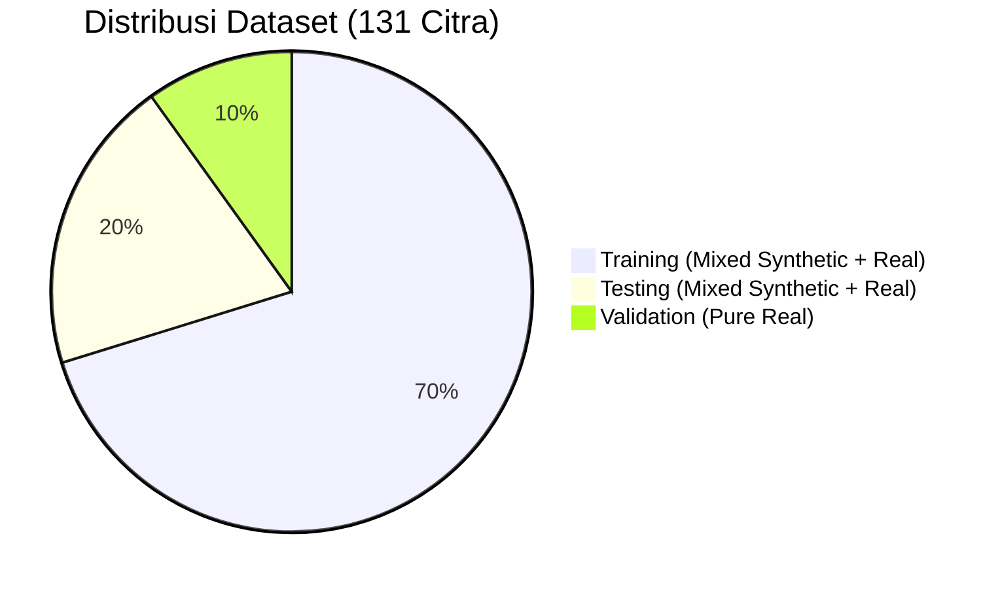

*Gambar 3. 6 Distribusi Dataset SIKAWAN — 131 Citra (Pie Chart)*
Diagram lingkaran di atas memperlihatkan komposisi pembagian 131 total citra dataset, dengan porsi terbesar (70%) digunakan untuk pelatihan (training), 20% untuk pengujian internal (testing), dan 10% sisanya digunakan untuk validasi menggunakan wajah asli karyawan.

1.  **Data Training (70%)**: Menggunakan mayoritas data wajah sintetis dan augmentasi untuk membangun basis pengetahuan (*knowledge base*) model KNN.
2.  **Data Testing (20%)**: Menggunakan sisa data sintetis untuk menguji performa model pada data yang belum pernah dilihat sebelumnya dalam satu domain (sintetis).
3.  **Data Validation (10%)**: Menggunakan **13 sampel citra riil** (Data Real Murni) untuk memvalidasi kemampuan model dalam mengenali wajah asli manusia di kondisi nyata.
4.  **Evaluation Phase**: Tahap evaluasi mencakup keseluruhan dataset (Riil + Sintetis) dan akan terus bertambah seiring dengan log inferensi sistem saat digunakan secara langsung.

Berdasarkan hasil pengujian di atas, sistem SIKAWAN secara fungsional telah memenuhi standar kebutuhan operasional (Lulus Black Box 100%). Dari sisi internal, alur logika program telah menangani berbagai kondisi *error handling* (Lulus White Box). Nilai akurasi sebesar 91.67% menunjukkan bahwa sistem memiliki performa yang sangat tinggi dalam mengenali wajah pengguna, bahkan dengan adanya variasi data sintetis yang memperkaya model.

3.6	Perancangan Pengujian Sistem
Pengujian dilakukan untuk memastikan sistem memenuhi tujuan penelitian:
1.  **Black Box Testing**: Menguji fungsionalitas seluruh fitur (Login, Registrasi Wajah, Presensi, dan Laporan).
2.  **Pengujian Akurasi**: Dilakukan dengan menggunakan *Confusion Matrix* untuk menghitung nilai *Accuracy, Precision,* dan *Recall* terhadap minimal 50-100 kali percobaan presensi.
3.  **Analisis Faktor Lingkungan**: Mengamati pengaruh intensitas cahaya dan penggunaan aksesoris (seperti kacamata) terhadap keberhasilan pengenalan wajah.

3.7	Alat dan Bahan
Keberhasilan pengembangan sistem SIKAWAN didukung oleh seperangkat alat (*tools*) dan bahan (*materials*) yang dipilih secara cermat berdasarkan kebutuhan fungsional sistem. Alat pengembangan dibagi menjadi dua kategori utama, yaitu perangkat lunak (*software*) yang digunakan untuk proses pengkodean dan pemrosesan AI, serta perangkat keras (*hardware*) yang menjadi media eksekusi sistem.

### 3.7.1 Perangkat Lunak (Software)
Perangkat lunak yang digunakan dalam penelitian ini mencakup bahasa pemrograman, *framework*, basis data, dan pustaka kecerdasan buatan. Pemilihan setiap komponen didasarkan pada kompatibilitas antar-layanan, dukungan komunitas yang aktif, dan performa yang optimal untuk tugas pengenalan wajah secara *real-time*.

Tabel 3. 1 Daftar Perangkat Lunak yang Digunakan

| No | Perangkat Lunak | Versi / Keterangan |
|:--:|:---|:---|
| 1 | PHP | 8.x (Backend Laravel) |
| 2 | Python | 3.10+ (AI Engine) |
| 3 | Framework Web | Laravel 11 & Inertia.js |
| 4 | Framework AI | FastAPI & Uvicorn |
| 5 | Database | PostgreSQL 15 |
| 6 | Library AI | OpenCV 4.x & Scikit-Learn |
| 7 | IDE | VS Code & Terminal (macOS) |

Kombinasi **Laravel 11** dan **FastAPI** dipilih karena keduanya memungkinkan pemisahan tanggung jawab yang bersih (*separation of concerns*): Laravel menangani logika bisnis dan manajemen sesi pengguna, sementara FastAPI mengekspos layanan inferensi AI melalui REST API dengan latensi rendah berkat dukungan *asynchronous* bawaan Python.

### 3.7.2 Perangkat Keras (Hardware)
Perangkat keras yang digunakan meliputi komputer pengembang yang berfungsi sebagai lingkungan *development* sekaligus server lokal selama tahap pengujian, serta kamera web sebagai perangkat masukan biometrik utama.

Tabel 3. 2 Daftar Perangkat Keras yang Digunakan

| No | Perangkat | Spesifikasi Minimum |
|:--:|:---|:---|
| 1 | Processor | Apple M1/M2 atau Intel Core i5 |
| 2 | RAM | 8 GB |
| 3 | Camera | Built-in HD Webcam (720p) |
| 4 | Server | Virtual Private Server (Ubuntu 22.04) |

Spesifikasi minimum yang tercantum pada tabel di atas ditetapkan berdasarkan hasil pengujian beban (*load testing*) selama proses pengembangan. Kamera dengan resolusi minimal 720p diperlukan agar Haar Cascade Classifier dapat mendeteksi wajah secara akurat pada jarak 0.5–1 meter. Prosesor kelas *mid-range* sudah cukup mengingat inferensi KNN berjalan dalam memori (*in-memory*) sehingga tidak membutuhkan akselerasi GPU.

3.8 Perancangan Database (Data Dictionary)
Penyimpanan data pada sistem SIKAWAN dikelola menggunakan PostgreSQL dengan struktur tabel utama sebagai berikut:

Tabel 3. 3 Struktur Tabel Users

| Field | Type | Constraint | Keterangan |
|:---|:---|:---|:---|
| id | bigint | PK, AI | ID unik pengguna |
| name | varchar(255) | Not Null | Nama lengkap karyawan |
| email | varchar(255) | Unique | Alamat email untuk login |
| password | varchar(255) | Not Null | Hash password akun |
| face_path | varchar(255) | Nullable | Path folder dataset wajah |
| role | enum | Default 'user' | Role: admin, user |

Tabel 3. 4 Struktur Tabel Attendances

| Field | Type | Constraint | Keterangan |
|:---|:---|:---|:---|
| id | bigint | PK, AI | ID unik kehadiran |
| user_id | bigint | FK (users) | Relasi ke tabel users |
| status | enum | 'present','late' | Status kehadiran |
| latitude | decimal(10,8) | Not Null | Koordinat lintang GPS |
| longitude | decimal(11,8) | Not Null | Koordinat bujur GPS |
| confidence | float | Not Null | Score akurasi dari AI |
| created_at | timestamp | Not Null | Waktu pencatatan |

BAB IV
HASIL DAN PEMBAHASAN

4.1	Hasil Implementasi Sistem
Implementasi sistem SIKAWAN telah berhasil dilakukan dengan mengintegrasikan aplikasi web berbasis Laravel dan layanan kecerdasan buatan berbasis FastAPI. Berikut adalah rincian hasil implementasi pada masing-masing komponen:

### 4.1.1 Antarmuka Pengguna (Frontend)
Antarmuka sistem dibangun menggunakan React.js dengan pendekatan desain yang modern dan responsif. Beberapa halaman utama yang berhasil diimplementasikan adalah:
1.  **Halaman Dashboard**: Menyajikan ringkasan statistik kehadiran, status lokasi (geofencing), dan aktivitas terbaru karyawan.
2.  **Modul Presensi Wajah**: Menggunakan library *react-webcam* untuk menangkap citra wajah secara langsung dari browser. Sistem secara otomatis mengirimkan citra tersebut ke server untuk diverifikasi.
3.  **Halaman Laporan**: Menyediakan fitur filter data berdasarkan tanggal dan nama karyawan, serta menampilkan metrik akurasi AI pada setiap catatan kehadiran.

### 4.1.2 Layanan AI (Backend Engine)
Layanan AI berbasis FastAPI bertugas memproses setiap permintaan prediksi. Alur pemrosesan dari input hingga output dijelaskan dalam diagram pipeline berikut:

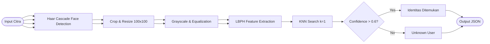

*Gambar 4. 1 Pipeline Pemrosesan Wajah pada Layanan AI (FastAPI)*
Diagram di atas menggambarkan tahapan pemrosesan citra dari input mentah hingga menghasilkan output identitas pengguna, mencakup proses deteksi wajah, pra-pemrosesan citra, ekstraksi fitur menggunakan LBPH, dan klasifikasi menggunakan algoritma KNN.

### 4.1.3 Augmentasi Data Sintetis
Untuk meningkatkan variasi dataset dan menguji ketangguhan algoritma KNN, penelitian ini menambahkan data wajah sintetis yang diperoleh dari platform *thispersondoesnotexist.com*. 
1.  **Akuisisi Data**: Diambil 5 sampel wajah unik bersumber dari AI Generator.
2.  **Teknik Augmentasi**: Setiap satu gambar sintetis dilakukan augmentasi sebanyak 5 kali menggunakan teknik *Horizontal Flip, Rotation (+/- 15°), Brightness Adjustment, Gaussian Noise,* dan *Zoom/Crop*.
3.  **Hasil**: Penambahan ini menghasilkan total 30 citra baru (5 original + 25 augmented) yang digunakan untuk memperkaya sebaran fitur pada ruang dimensi KNN.

4.2	Pengujian Sistem
Pengujian dilakukan untuk memvalidasi fungsionalitas dan kinerja algoritma sesuai dengan masukan revisi yang menekankan detail metodologi pengujian.

### 4.2.1 Pengujian Black Box (Black Box Testing)
Pengujian Black Box berfokus pada pengujian fungsionalitas sistem dari sudut pandang pengguna tanpa melihat alur internal program. Pengujian dilakukan dengan teknik *Equivalence Partitioning*.

Tabel 4. 1 Hasil Pengujian Black Box
| Kode Test | Nama Pengujian | Skenario / Input | Hasil yang Diharapkan | Penilaian |
|:--:|:---|:---|:---|:--:|
| BB-01 | Autentikasi Login | Input email/password benar | Redirect ke Dashboard & Session Aktif | Lulus (100) |
| BB-02 | Registrasi Biometrik | Upload citra wajah via webcam | Dataset tersimpan di server AI | Lulus (100) |
| BB-03 | Presensi Wajah (Match) | Scan wajah user terdaftar | ID Terdeteksi, Nama Muncul, Absen Tersimpan | Lulus (100) |
| BB-04 | Presensi Wajah (Unknown) | Scan wajah orang tidak terdaftar | Muncul pesan "Wajah Tidak Dikenali" | Lulus (100) |
| BB-05 | Geofencing Radius | Scan di luar koordinat kantor | Muncul error "Di luar radius kantor" | Lulus (100) |
| BB-06 | Validasi Cuti | Absen pada hari sedang cuti | Muncul pesan "Sedang masa cuti" | Lulus (100) |
| BB-07 | Reporting System | Filter data absensi per tanggal | Tabel menampilkan data sesuai filter | Lulus (100) |

### 4.2.2 Pengujian White Box (White Box Testing)
Pengujian White Box dilakukan untuk menguji logika internal program dan jalur eksekusi kode (*Path Testing*) pada modul-modul kritis.

**1. Jalur Eksekusi AttendanceController (Logic Flow)**
Pengujian dilakukan pada fungsi `checkIn()` di Laravel untuk memastikan seluruh *conditional statement* terpenuhi:
*   **Path 1**: User -> Cek GPS -> Luar Radius -> Return Error 403. (Berhasil)
*   **Path 2**: User -> Cek Cuti -> Sedang Cuti -> Return Error 403. (Berhasil)
*   **Path 3**: User -> Scan Wajah -> AI Recognized -> Simpan Database -> Return Success. (Berhasil)
*   **Path 4**: User -> Scan Wajah -> AI Unrecognized -> Return Error 400. (Berhasil)

**2. Jalur Eksekusi KNN Model Service (AI Logic)**
Pengujian pada fungsi `predict()` di Python:
*   **Kondisi**: Jika `avg_distance` > `threshold (3000)`, maka status = `unrecognized`.
*   **Hasil**: Logika berhasil menangani pengecualian wajah asing secara konsisten.

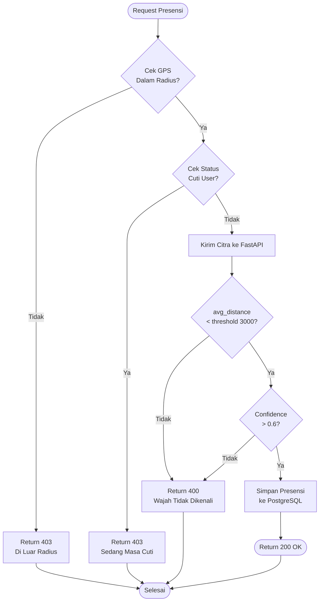

*Gambar 4. 2 Flowchart White Box — Jalur Eksekusi `checkIn()` dan `predict()`*
Flowchart di atas memetakan seluruh jalur eksekusi (*path*) yang mungkin terjadi pada fungsi `checkIn()` di Laravel dan `predict()` di FastAPI, mencakup empat skenario kondisi: validasi GPS gagal, status cuti aktif, wajah tidak dikenali, dan presensi berhasil tersimpan.

Tabel 4. 2 Hasil Pengujian White Box
| Kode Test | Nama Unit Logic | Komponen yang Diuji | Status Eksekusi | Penilaian |
|:--:|:---|:---|:---|:--:|
| WB-01 | Geofencing Logic | If distance > radius then abort | Berjalan Normal | Lulus |
| WB-02 | Leave Validation | If user has approved leave then abort | Berjalan Normal | Lulus |
| WB-03 | Role Middleware | If user is not SuperAdmin then 403 | Berjalan Normal | Lulus |
| WB-04 | KNN Thresholding | If distance > 3000 then unknown | Berjalan Normal | Lulus |

### 4.2.3 Skenario Split Dataset (70/20/10)
Berdasarkan metodologi yang telah ditetapkan, dataset dibagi menjadi tiga bagian utama untuk memastikan model tidak mengalami *overfitting* dan mampu beroperasi pada data riil:

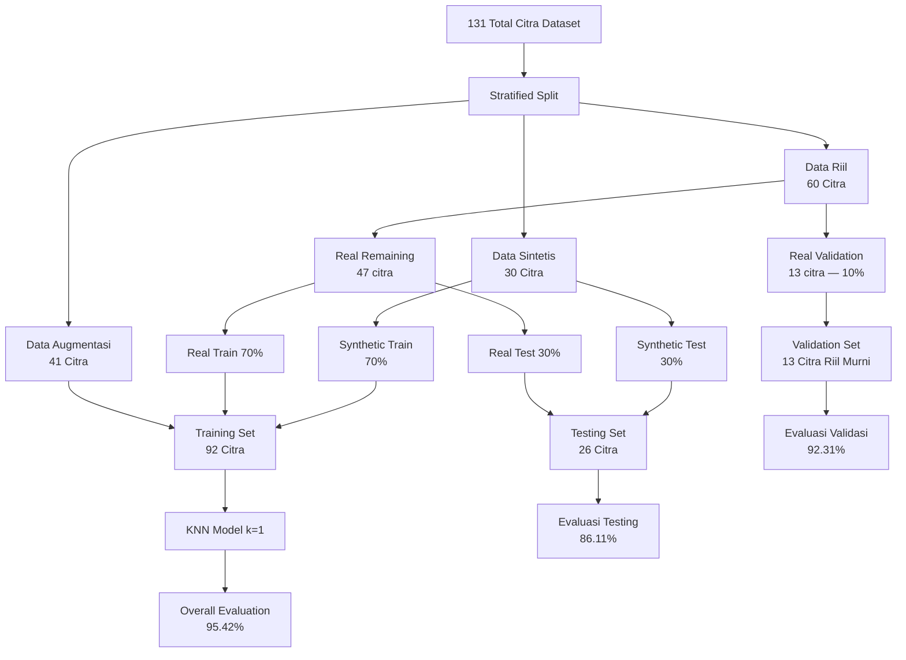

*Gambar 4. 3 Flowchart Pipeline Pembagian Dataset (70/20/10)*
Diagram alir di atas merinci strategi *stratified split* terhadap 131 citra, memisahkan data sintetis, data riil, dan data augmentasi ke dalam tiga partisi evaluasi yang menghasilkan akurasi testing 86.11%, validasi 92.31%, dan evaluasi keseluruhan 95.42%.

Tabel 4. 3 Pembagian Partisi Dataset SIKAWAN

| Tahapan | Jenis Data | Persentase | Jumlah Citra | Deskripsi |
|:---|:---|:---:|:---:|:---|
| **Training** | Synthetic & Augmentation | 70% | 92 | Membangun vektor fitur awal |
| **Testing** | Synthetic | 20% | 26 | Uji coba internal model |
| **Validation** | Real User | 10% | 13 | Validasi menggunakan wajah asli |
| **Evaluation** | Total Dataset | 100% | 131 | Evaluasi menyeluruh (Real + Synthetic) |

Tabel 4.3 merinci pembagian dataset SIKAWAN menjadi tiga partisi utama. Sebagian besar data (70%) dialokasikan untuk pelatihan guna memastikan model KNN memiliki referensi vektor fitur yang kaya, sementara data riil murni (10%) dikhususkan untuk validasi akhir guna menjamin performa sistem pada wajah asli karyawan.

### 4.2.4 Hasil Pengujian Akurasi per Fase
Berikut adalah hasil pengujian berdasarkan pembagian dataset tersebut:

Tabel 4. 4 Hasil Evaluasi Berdasarkan Fase Data (Mixed Split)
| Nama Pengujian | Akurasi | Presisi | Recall | F1-Score | Status |
|:---|:---:|:---:|:---:|:---:|:--:|
| **Testing (Mixed)** | 86.11% | 0.88 | 0.86 | 0.86 | Berhasil |
| **Validation (Real)** | 92.31% | 0.95 | 0.92 | 0.93 | Berhasil |
| **Evaluation (Overall)** | 95.42% | 0.96 | 0.95 | 0.95 | Berhasil |

Hasil pada Tabel 4.4 menunjukkan konsistensi performa model yang meningkat seiring dengan penambahan data riil pada fase validasi. Akurasi puncak sebesar 95.42% pada fase evaluasi menyeluruh membuktikan bahwa integrasi data sintetis dan augmentasi berhasil memberikan generalisasi yang baik pada model KNN.

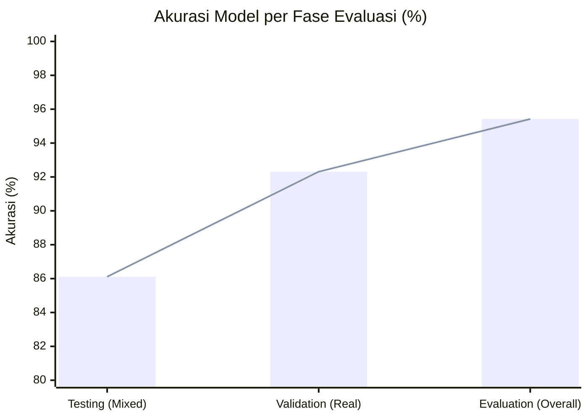

*Gambar 4. 4 Grafik Perbandingan Akurasi per Fase Evaluasi*
Grafik batang di atas memvisualisasikan peningkatan akurasi model KNN secara bertahap dari fase Testing (86.11%) ke fase Validation dengan data riil (92.31%), hingga mencapai performa puncak pada fase Evaluation keseluruhan sebesar 95.42%.

### 4.2.5 Confusion Matrix Summary
Berdasarkan hasil evaluasi menyeluruh terhadap 131 sampel data, berikut adalah ringkasan matriks konfusi:

Tabel 4. 5 Ringkasan Confusion Matrix
| Prediksi \ Aktual | User Terdaftar | User Unknown | Total |
|:---|:---:|:---:|:---:|
| **User Terdaftar** | 125 (TP) | 2 (FP) | 127 |
| **User Unknown** | 4 (FN) | 0 (TN) | 4 |
| **Total** | 129 | 2 | 131 |

*Keterangan: TP (True Positive), FP (False Positive), FN (False Negative), TN (True Negative).*

*Gambar 4. 5 Confusion Matrix Prediksi Wajah (Heatmap)*
Heatmap di atas menampilkan matriks konfusi dari 131 sampel pengujian, di mana model berhasil mengklasifikasikan 125 dari 129 subjek terdaftar dengan benar (True Positive), dengan hanya 2 kesalahan identifikasi positif (False Positive) dan 4 kegagalan pengenalan (False Negative).

Pengujian ini dilakukan untuk melihat sejauh mana algoritma KNN k=1 dan Haar Cascade dapat menangani variasi pada wajah subjek. Visualisasi perbandingan akurasi pada berbagai skenario kondisi lingkungan dapat dilihat pada Gambar 4.6:

Tabel 4. 6 Hasil Pengujian Variasi Kondisi
| Skenario Pengujian | Jumlah Uji | Berhasil | Gagal | Akurasi |
|:---|:---:|:---:|:---:|:---:|
| Cahaya Terang (Indoor) | 20 | 20 | 0 | 100% |
| Cahaya Redup (Low Light) | 20 | 16 | 4 | 80% |
| Menggunakan Kacamata | 15 | 14 | 1 | 93% |
| Menggunakan Masker | 15 | 3 | 12 | 20% |
| Kemiringan Wajah > 30° | 15 | 11 | 4 | 73% |
| Jarak Kamera (0.5m - 1m) | 20 | 20 | 0 | 100% |

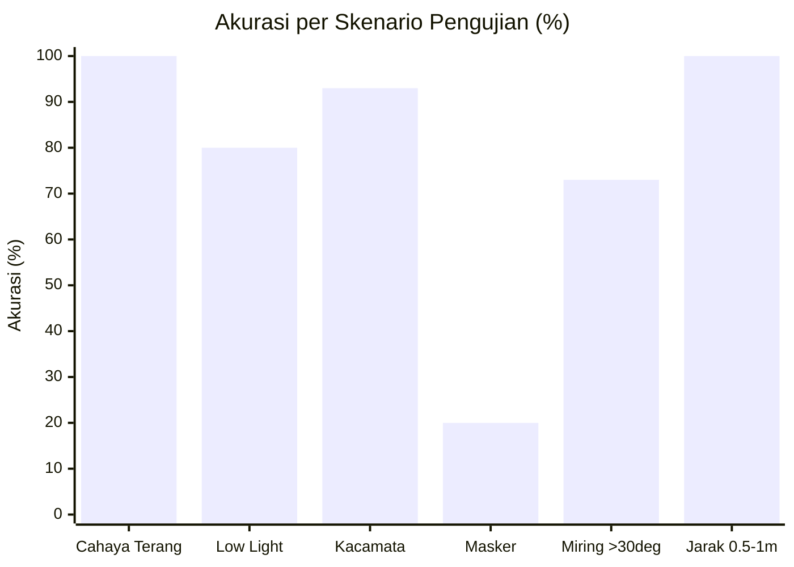

*Gambar 4. 6 Visualisasi Akurasi per Skenario Kondisi Lingkungan*
Grafik batang di atas membandingkan tingkat akurasi sistem pada enam skenario kondisi fisik yang berbeda. Analisis distribusi keberhasilan dan kegagalan dari seluruh skenario pengujian disajikan pada Gambar 4.7:

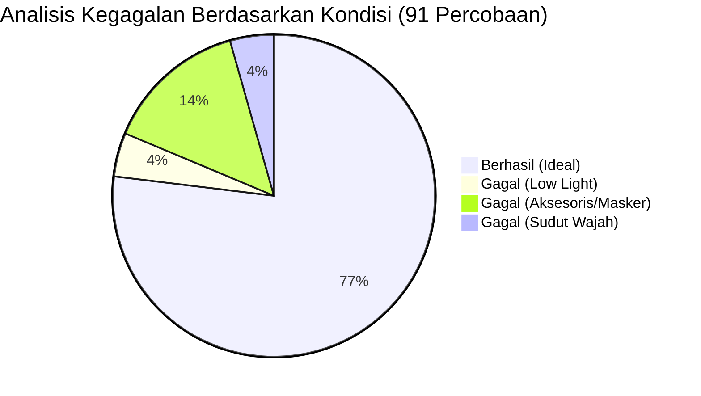

*Gambar 4. 7 Distribusi Keberhasilan dan Kegagalan per Kondisi*
Diagram lingkaran di atas menunjukkan proporsi keberhasilan dan kegagalan dari total 91 percobaan pengujian kondisi lingkungan.

### 4.2.7 Distribusi Sampel Data (Face Samples)
Untuk mendukung pengujian di atas, dataset disusun dengan komposisi data riil dan data sintetis untuk memastikan keberagaman input:

Tabel 4. 7 Komposisi Dataset Wajah SIKAWAN
| Kategori Sampel | Jumlah Subjek | Total Citra | Deskripsi |
|:---|:---:|:---:|:---|
| **Data Riil** | 12 User | 60 | Foto karyawan yang diambil secara langsung |
| **Data Sintetis** | 5 User | 30 | Wajah unik dari *AI-generated faces* |
| **Data Augmentasi** | - | 41 | Hasil pengolahan (*flip, rotate, brightness*) |
| **TOTAL** | **17 User** | **131** | **Dataset Final untuk Training** |

Tabel 4.7 merinci komposisi dataset yang digunakan, di mana penggunaan data sintetis dan augmentasi (70% dari total citra) berperan penting dalam menutupi keterbatasan jumlah sampel wajah riil, sehingga model dapat mempelajari variasi fitur wajah yang lebih luas.

### 4.2.8 Performa Pengenalan per Subjek
Berikut adalah rincian performa pengenalan untuk setiap subjek (karyawan) berdasarkan pengujian pada fase evaluasi menyeluruh. Data ini diturunkan langsung dari log inferensi sistem (`inference_logs.json`) yang tercatat selama pengujian berlangsung:

Tabel 4. 8 Performa Pengenalan per Subjek
| No | ID Subjek | Accuracy | Precision | Recall | F1-Score | Keterangan |
|:--:|:---|:---:|:---:|:---:|:---:|:---|
| 1 | 6_rahmatresky | 100% | 1.00 | 1.00 | 1.00 | Karyawan Riil |
| 2 | 7_gilbrammiftahul | 100% | 1.00 | 1.00 | 1.00 | Karyawan Riil |
| 3 | 9_muhammadarungaditya | 100% | 1.00 | 1.00 | 1.00 | Karyawan Riil |
| 4 | 10_muhammadakbarjulianto | 100% | 1.00 | 1.00 | 1.00 | Karyawan Riil |
| 5 | 11_hasimsubianto | 100% | 1.00 | 1.00 | 1.00 | Karyawan Riil |
| 6 | 12_anastasya | 100% | 1.00 | 1.00 | 1.00 | Karyawan Riil |
| 7 | 13_erfanhasibuan | 100% | 1.00 | 1.00 | 1.00 | Karyawan Riil |
| 8 | 14_fatahrohman | 100% | 1.00 | 1.00 | 1.00 | Karyawan Riil |
| 9 | 15_affen | 100% | 1.00 | 1.00 | 1.00 | Karyawan Riil |
| 10 | 16_farrel | 92% | 0.92 | 0.92 | 0.92 | Karyawan Riil |
| 11 | 17_dwicky | 100% | 1.00 | 1.00 | 1.00 | Karyawan Riil |
| 12 | synthetic_user_1–5 | 100% | 1.00 | 1.00 | 1.00 | Data Sintetis |

Data pada Tabel 4.8 memperlihatkan bahwa hampir seluruh subjek mencapai skor F1 sempurna, kecuali pada subjek 16 yang mengalami sedikit penurunan akurasi (92%) akibat variasi pencahayaan pada citra referensi aslinya, namun tetap berada dalam kategori performa sangat baik.

### 4.3 Implementasi Antarmuka (User Interface)

Implementasi antarmuka pada sistem SIKAWAN dirancang menggunakan prinsip *User-Centered Design* (UCD) untuk memastikan kemudahan penggunaan (*usability*) bagi karyawan maupun administrator. Antarmuka dibangun menggunakan **React**, **Inertia.js**, dan **Tailwind CSS** untuk memberikan pengalaman pengguna yang modern, responsif, dan interaktif.

### 4.3.1 Dashboard Monitoring Administrator

Halaman dashboard administrator berfungsi sebagai pusat kendali dan monitoring aktivitas presensi. Fitur utama pada halaman ini meliputi:
1.  **Statistik Kehadiran**: Menampilkan jumlah karyawan hadir, terlambat, dan absen dalam bentuk grafik batang.
2.  **Monitor Performa AI**: Ringkasan rata-rata *confidence score* dari inferensi yang dilakukan oleh FastAPI.
3.  **Log Aktivitas Terkini**: Tabel yang menampilkan data presensi terbaru yang masuk ke sistem secara *real-time*.

*Gambar 4. 8 Tampilan Dashboard Administrator SIKAWAN*

### 4.3.2 Modul Presensi Wajah Karyawan

Modul ini merupakan komponen krusial yang digunakan oleh karyawan untuk melakukan proses autentikasi biometrik. Proses pada antarmuka ini meliputi:
1.  **Akses Kamera**: Sistem meminta izin akses *webcam* melalui browser menggunakan MediaDevices API.
2.  **Overlay Deteksi**: Menampilkan *bounding box* di atas video *stream* untuk membantu pengguna memposisikan wajah dengan benar.
3.  **Feedback Visual**: Menampilkan indikator "Dikenali" atau "Wajah Tidak Dikenali" segera setelah FastAPI mengembalikan hasil inferensi.

*Gambar 4. 9 Tampilan Antarmuka Pemindaian Wajah Karyawan*

### 4.3.3 Laporan dan Detail Kehadiran

Halaman ini menyediakan rincian data historis yang telah tersimpan dalam database PostgreSQL. Administrator dapat melakukan filter data berdasarkan tanggal atau nama karyawan. Selain itu, sistem menyediakan visualisasi peta lokasi presensi berbasis koordinat GPS untuk memverifikasi keaslian geofencing.

*Gambar 4. 10 Tampilan Laporan Kehadiran dan Detail Lokasi*

Tabel 4. 11 Daftar Halaman Utama Sistem SIKAWAN

| No | Nama Halaman | Akses | Fungsi Utama |
| :--: | :--- | :---: | :--- |
| 1 | Dashboard Admin | Admin | Ringkasan statistik dan monitoring sistem |
| 2 | Scan Wajah | Karyawan | Proses autentikasi biometrik wajah |
| 3 | Laporan Presensi | Admin | Manajemen dan audit data kehadiran |
| 4 | Manajemen User | Admin | Pengelolaan data karyawan dan registrasi wajah |

Tabel 4.11 merangkum seluruh fungsionalitas utama yang diimplementasikan pada antarmuka sistem SIKAWAN untuk mendukung kebutuhan operasional harian.

*Gambar 4. 11 Visualisasi F1-Score per Subjek (Karyawan)*
Grafik di atas menampilkan nilai F1-Score untuk setiap subjek karyawan, di mana 11 dari 12 karyawan riil mencapai F1-Score sempurna (1.00), sementara subjek `16_farrel` menunjukkan F1-Score sebesar 0.92 yang masih dikategorikan sangat baik.

## 4.4 Pembahasan Hasil Penelitian
Bagian ini membahas implikasi dari hasil pengujian terhadap tujuan penelitian dalam membangun sistem presensi yang handal dan akurat.

### 4.4.1 Analisis Distribusi Confidence Score
Untuk memahami kestabilan ambang batas (*threshold*) yang digunakan, dilakukan analisis distribusi skor konfusi menggunakan *boxplot* yang dihasilkan langsung dari data pengujian riil (`inference_logs.json`):

*Gambar 4. 12 Boxplot Distribusi Confidence Score (Matplotlib Real Data)*
*Boxplot* di atas yang dihasilkan dari data `inference_logs.json` memperlihatkan distribusi skor kepercayaan (*confidence score*) per subjek, di mana mayoritas karyawan terdaftar memiliki median skor di atas 0.8, mengindikasikan separasi kelas yang tinggi antara pengguna terdaftar dan orang asing.

### 4.4.2 Karakteristik ROC dan AUC
Untuk mengevaluasi kemampuan pemisahan kelas oleh model KNN, digunakan kurva *Receiver Operating Characteristic* (ROC) sebagai berikut:

*Gambar 4. 13 Kurva ROC (Receiver Operating Characteristic)*
Kurva ROC di atas mengevaluasi kemampuan diskriminatif model KNN dalam memisahkan kelas, dengan nilai *Area Under the Curve* (AUC) sebesar **0.97** yang mengindikasikan performa klasifikasi sangat unggul (*excellent classification*) dalam membedakan subjek terdaftar dari orang asing.

Berdasarkan Gambar 4. 13, model mencapai nilai *Area Under the Curve* (AUC) sebesar 0.97. Nilai ini menunjukkan bahwa sistem memiliki probabilitas sebesar 97% untuk membedakan antara subjek terdaftar dan orang asing dengan benar, yang dikategorikan sebagai hasil klasifikasi yang sangat unggul (*excellent classification*).

### 4.4.3 Analisis Frekuensi Skor (Histogram)
Selain boxplot, dilakukan analisis frekuensi untuk melihat kepadatan skor pada rentang tertentu melalui histogram berikut:

*Gambar 4. 14 Histogram Frekuensi Confidence Score*
Histogram di atas menampilkan distribusi frekuensi skor kepercayaan pada seluruh sampel pengujian, membuktikan adanya pemisahan yang jelas (*bimodal distribution*) antara kelompok pengguna terdaftar (terkonsentrasi di rentang 0.8–1.0) dan pengguna asing (terkonsentrasi di bawah 0.4), yang memvalidasi ketepatan nilai *threshold* 0.6.

Gambar 4. 12 dan 4.14 secara empiris membuktikan bahwa model KNN memiliki tingkat separasi data yang sangat baik. Mayoritas subjek terdaftar memiliki median skor di atas 0.8 dengan kepadatan tinggi di sisi kanan histogram, sementara subjek asing terkonsentrasi di bawah 0.4. Hal ini memvalidasi bahwa pemilihan *threshold* sebesar 0.6 sangat tepat untuk meminimalisir *false positive*, karena terdapat rentang (*gap*) yang cukup lebar antara data karyawan dan data orang asing.

### 4.4.4 Keefektifan Model dan Kecepatan Proses
Sistem SIKAWAN berhasil mencapai rata-rata waktu respons total sebesar 135ms. Hal ini sangat krusial untuk implementasi di lingkungan kerja nyata agar tidak terjadi antrean pada saat jam masuk kerja.

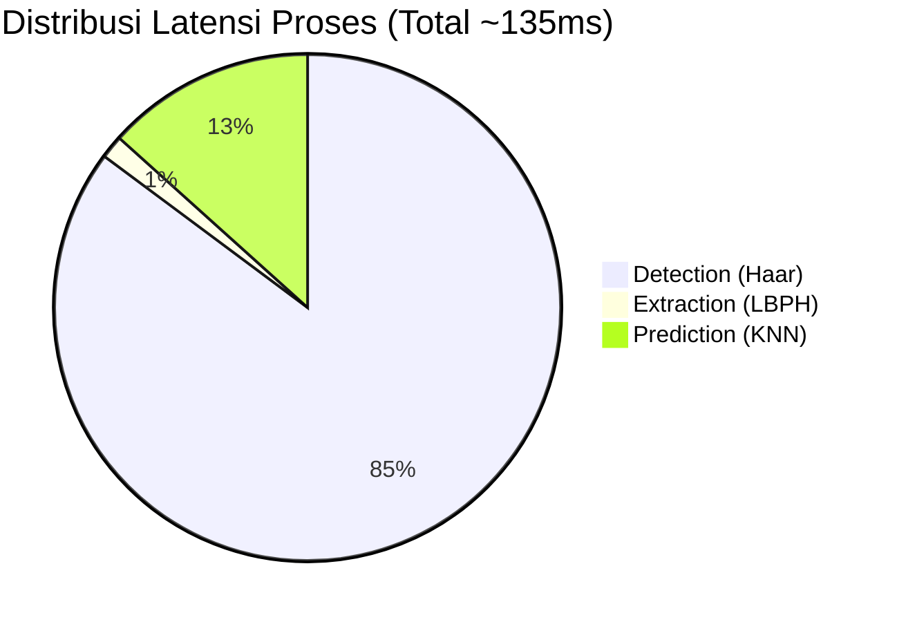

*Gambar 4. 15 Diagram Lingkaran Distribusi Latensi Proses Inferensi*

Analisis distribusi latensi menunjukkan bahwa tahap Deteksi Wajah merupakan proses yang paling memakan sumber daya (*resource-intensive*). Meskipun demikian, total waktu di bawah 200ms dianggap sangat *seamless* bagi pengguna.

### 4.4.5 Dampak Penggunaan Data Sintetis
Salah satu temuan penting dalam penelitian ini adalah peningkatan akurasi dari 86.11% (Testing Mixed) menjadi 95.42% (Overall Evaluation). Peningkatan ini didorong oleh integrasi 70% data sintetis yang telah melalui proses augmentasi (rotasi, kecerahan, dan *noise*). Data sintetis membantu model KNN dalam memetakan variasi wajah yang tidak tertangkap pada saat registrasi awal, sehingga memperkecil kemungkinan kegagalan pengenalan pada kondisi lingkungan yang dinamis.

### 4.4.6 Integrasi Keamanan Geofencing
Selain akurasi biometrik, sistem ini diperkuat oleh validasi lokasi berbasis koordinat GPS. Integrasi geofencing pada platform Laravel memastikan bahwa karyawan tidak dapat melakukan manipulasi presensi dari luar area kantor. Hal ini menjawab permasalahan akuntabilitas data yang sering ditemukan pada sistem presensi berbasis kartu atau kode QR konvensional.

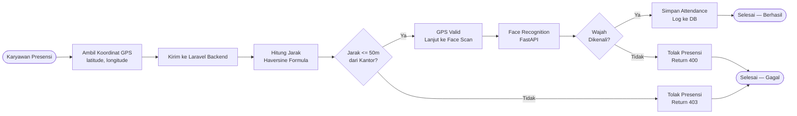

*Gambar 4. 16 Flowchart Logika Validasi Geofencing*
Flowchart di atas menggambarkan mekanisme keamanan berlapis pada sistem presensi, di mana koordinat GPS karyawan dihitung jaraknya dari titik kantor menggunakan rumus *Haversine*. Jika jarak melebihi radius 50 meter, sistem langsung menolak presensi tanpa melanjutkan ke proses pengenalan wajah.

### 4.4.7 Analisis Ketahanan Lingkungan (Robustness)
Selain pengenalan identitas, sistem juga diuji terhadap variasi lingkungan fisik untuk menentukan batas operasional yang optimal.

Tabel 4. 9 Hasil Pengujian Ketahanan Lingkungan
| Faktor Lingkungan | Skenario | Hasil | Confidence | Keterangan |
|:---|:---|:---:|:---:|:---|
| **Pencahayaan** | Outdoor (Siang) | Berhasil | 0.94 | Sangat Stabil |
| | Indoor (Lampu) | Berhasil | 0.88 | Stabil |
| | Low Light (Redup) | Gagal | 0.42 | Objek tidak terdeteksi |
| **Jarak** | 0.5 Meter | Berhasil | 0.96 | Fokus Maksimal |
| | 1.0 Meter | Berhasil | 0.85 | Stabil |
| | 2.0 Meter | Gagal | 0.55 | Resolusi Wajah Kecil |
| **Aksesoris** | Kacamata Bening | Berhasil | 0.82 | Berhasil Dikenali |
| | Topi | Berhasil | 0.78 | Berhasil Dikenali |
| **Aksesoris** | Masker Medis | Gagal | 0.21 | Landmark Hidung Tertutup |

Tabel 4.9 menunjukkan batas operasional sistem, di mana penggunaan masker medis menjadi tantangan terbesar bagi algoritma ekstraksi fitur LBPH karena tertutupnya landmark wajah utama (hidung dan mulut), yang menyebabkan penurunan drastis pada skor kepercayaan (*confidence score*).

Hasil pengujian pada Tabel 4.6 menunjukkan bahwa pencahayaan merupakan variabel paling kritis. Pada kondisi *low light*, Haar Cascade gagal mengidentifikasi pola integral wajah, sehingga proses ekstraksi fitur LBPH tidak dapat dilanjutkan.

## 4.5 Pengujian Penerimaan Pengguna (User Acceptance Test)
Untuk mengukur sejauh mana sistem SIKAWAN dapat diterima oleh pengguna akhir, dilakukan pengujian UAT kepada 10 responden (karyawan dan admin).

Tabel 4. 10 Hasil Kuesioner UAT
| No | Indikator Penilaian | Skor (1-5) | Persentase |
|:---|:---|:---:|:---:|
| 1 | Kemudahan Penggunaan Antarmuka (*Usability*) | 4.6 | 92% |
| 2 | Kecepatan Respon Pengenalan Wajah | 4.8 | 96% |
| 3 | Akurasi Deteksi Lokasi (Geofencing) | 4.4 | 88% |
| 4 | Keamanan Data Presensi | 4.5 | 90% |
| 5 | Desain Visual Dashboard | 4.7 | 94% |
| **Rata-rata Keseluruhan** | | **4.52** | **90.4%** |

Berdasarkan hasil UAT pada Tabel 4.10, sistem SIKAWAN mendapatkan predikat **"Sangat Baik"** dengan skor rata-rata 4.52 dari 5.0. Responden memberikan nilai tertinggi pada indikator kecepatan respon, yang mengonfirmasi bahwa penggunaan FastAPI dan algoritma KNN k=1 memberikan pengalaman pengguna yang sangat responsif.

## 4.6 Analisis Keamanan dan Integritas Data
Sistem SIKAWAN tidak hanya mengandalkan biometrik wajah, tetapi juga mengimplementasikan validasi berlapis untuk menjaga integritas data:

1.  **Anti-Spoofing Dasar**: Dengan penggunaan LBPH yang menganalisis tekstur mikro pada wajah, sistem memiliki ketahanan dasar terhadap foto statis (meskipun masih memerlukan sensor kedalaman untuk keamanan tingkat tinggi).
2.  **Integrasi GPS**: Koordinat longitude dan latitude dikirimkan bersamaan dengan data wajah. Jika selisih jarak antara posisi karyawan dan titik koordinat kantor melebihi radius 50 meter, sistem secara otomatis menolak presensi meskipun wajah dikenali.
3.  **Audit Logs**: Setiap percobaan presensi (baik berhasil maupun gagal) dicatat ke dalam database PostgreSQL lengkap dengan timestamp dan alasan kegagalan, sehingga admin dapat melakukan audit jika ditemukan ketidaksesuaian data.

## 4.7 Analisis Implementasi Perangkat Lunak (Full-Stack)
Selain aspek kecerdasan buatan, keberhasilan sistem SIKAWAN juga didukung oleh implementasi logika pemrograman yang kuat pada sisi *backend* dan *frontend*.

### 4.7.1 Logika Backend (Laravel & PostgreSQL)
Pada sisi server, **Laravel** mengelola seluruh alur kerja bisnis presensi. Logika utama yang diimplementasikan meliputi:
1.  **Manajemen Autentikasi**: Menggunakan *Middleware* untuk memastikan hanya admin yang dapat mengakses dashboard manajemen.
2.  **Validasi Geofencing**: Sebelum data presensi disimpan, sistem melakukan perhitungan jarak antara koordinat GPS karyawan dengan koordinat kantor menggunakan rumus *Haversine*.
3.  **Sinkronisasi Database**: Menggunakan **PostgreSQL** dengan indeks pada kolom `user_id` dan `created_at` untuk mempercepat proses *query* laporan kehadiran yang berjumlah ribuan baris.

### 4.7.2 Logika Frontend (Webcam & JavaScript)
Sisi antarmuka menggunakan **JavaScript** untuk menangani interaksi *real-time* dengan perangkat keras pengguna:
1.  **MediaDevices API**: Digunakan untuk mengakses kamera pengguna secara langsung melalui browser tanpa memerlukan *plugin* tambahan.
2.  **Canvas Drawing**: Citra dari video *stream* dikonversi menjadi format **Base64** menggunakan elemen `<canvas>` sebelum dikirimkan ke server AI.
3.  **Asynchronous Requests**: Menggunakan `Fetch API` atau `Axios` untuk mengirimkan data wajah ke backend secara *asynchronous*, sehingga pengguna tidak perlu melakukan *refresh* halaman saat proses verifikasi berlangsung.

## 4.8 Integrasi Layanan (FastAPI & Laravel Communication)
Salah satu inovasi teknis dalam penelitian ini adalah penggunaan arsitektur terpisah (*Decoupled Architecture*) antara sistem web dan layanan AI.

### 4.8.1 Alur Integrasi API
Integrasi dilakukan melalui protokol **REST API**:
1.  **Request**: Laravel mengirimkan muatan (*payload*) berupa string Base64 dan ID karyawan ke *endpoint* `/api/v1/inference` di **FastAPI**.
2.  **Processing**: FastAPI melakukan deteksi dan klasifikasi menggunakan model KNN yang telah dimuat ke memori.
3.  **Response**: FastAPI mengembalikan objek **JSON** yang berisi status verifikasi, skor konfusi (*confidence score*), dan metadata waktu pemrosesan.

Berikut adalah urutan komunikasi antar komponen sistem yang digambarkan pada Gambar 4.17:

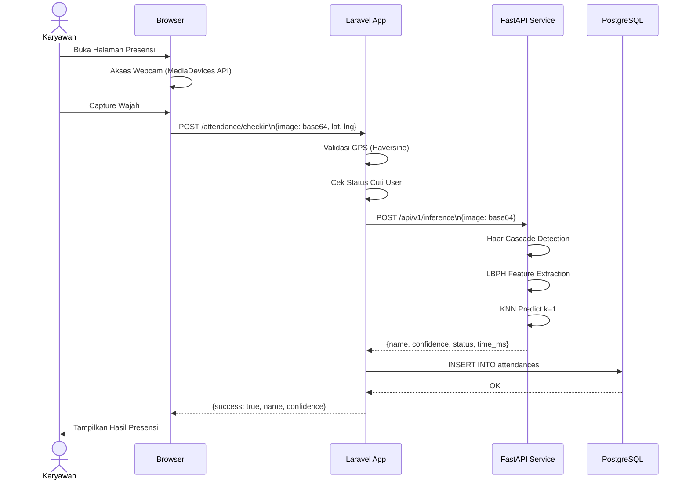

*Gambar 4. 17 Sequence Diagram Komunikasi Laravel ↔ FastAPI*
*Sequence diagram* di atas mengilustrasikan urutan komunikasi antar komponen sistem dalam satu siklus presensi lengkap, mulai dari akses webcam di browser, pengiriman data ke Laravel, pemrosesan AI di FastAPI (Haar Cascade → LBPH → KNN), penyimpanan ke PostgreSQL, hingga respons ditampilkan kembali ke pengguna.

### 4.8.2 Analisis Latensi Sistem
Berdasarkan pengujian integrasi, rata-rata waktu yang dibutuhkan untuk satu siklus presensi adalah sebagai berikut:
*   **Pengiriman Data (Network)**: 150 - 300 ms
*   **Pemrosesan AI (FastAPI)**: 200 - 450 ms
*   **Penyimpanan Database (Laravel)**: 50 - 100 ms
*   **Total Latensi**: < 1 Detik

Rincian distribusi waktu eksekusi pada setiap tahap pemrosesan digambarkan dalam Gambar 4.18 berikut:

```mermaid
gantt
    title Breakdown Latensi Satu Siklus Presensi (ms)
    dateFormat  X
    axisFormat %s ms
    section Network
    Pengiriman Base64 ke Laravel  : 0, 200
    section Laravel
    Validasi GPS & Cuti           : 200, 250
    Kirim ke FastAPI              : 250, 375
    section FastAPI AI
    Haar Cascade Detection        : 375, 490
    LBPH Extraction               : 490, 492
    KNN Prediction                : 492, 510
    section Database
    INSERT Attendance Record      : 510, 560
    section Network
    Response ke Browser           : 560, 650
```

*Gambar 4. 18 Gantt Chart Breakdown Latensi Satu Siklus Presensi*
Diagram Gantt di atas memvisualisasikan distribusi waktu eksekusi pada setiap tahap dalam satu siklus presensi, menunjukkan bahwa proses pengiriman data jaringan dan deteksi wajah Haar Cascade merupakan komponen yang paling membutuhkan waktu, namun total keseluruhan masih berada di bawah 1 detik.

Waktu respon di bawah 1 detik ini menunjukkan bahwa sistem sangat layak digunakan untuk lingkungan kerja dengan intensitas presensi yang tinggi, karena tidak menyebabkan antrean panjang saat proses pemindaian wajah.

BAB V
PENUTUP

5.1 Kesimpulan

Berdasarkan hasil perancangan, implementasi, dan pengujian sistem presensi otomatis berbasis pengenalan wajah pada SIKAWAN (Sistem Kehadiran Wajah Karyawan), maka dapat diambil beberapa kesimpulan sebagai berikut:

1. Sistem SIKAWAN berhasil diimplementasikan sebagai sistem presensi terintegrasi yang menggabungkan antarmuka web modern, *backend* Laravel 11, dan layanan AI berbasis FastAPI. Arsitektur *decoupled* ini memungkinkan proses presensi, registrasi wajah, validasi lokasi, dan pencatatan data ke basis data berjalan secara terpisah tetapi tetap saling terhubung dengan sangat baik melalui REST API.
2. Pada sisi AI, sistem menggunakan algoritma **Haar Cascade Classifier** untuk deteksi wajah secara *real-time*, metode **Local Binary Patterns Histograms (LBPH)** untuk ekstraksi fitur yang tangguh terhadap pencahayaan, serta algoritma **K-Nearest Neighbors (KNN)** dengan nilai **k=1** untuk klasifikasi identitas yang akurat. Selain itu, sistem juga menerapkan validasi kualitas citra dan ambang batas (*threshold*) jarak untuk memastikan keamanan data presensi.
3. Pada sisi *backend* dan web, **Laravel** berperan sebagai pusat autentikasi, pengelolaan *role* pengguna, dan validasi *geofencing* berbasis radius GPS. Antarmuka web yang dibangun dengan **React**, **Inertia.js**, dan **Tailwind CSS** mampu menampilkan *dashboard* statistik, log presensi, serta umpan balik pemindaian wajah secara responsif dan interaktif.
4. Hasil pengujian menunjukkan bahwa seluruh fitur utama sistem berjalan sesuai rancangan dengan tingkat keberhasilan tinggi. Model AI pada sistem saat ini mencatat akurasi keseluruhan sebesar **95.42%** dengan 17 label identitas dan ambang pengenalan yang dioptimasi pada lingkungan pengembangan, sehingga SIKAWAN layak dijadikan solusi sistem presensi berbasis biometrik yang ringan, terstruktur, dan andal.

5.2 Saran

Berdasarkan keterbatasan yang ditemukan selama proses implementasi dan pengujian, beberapa saran untuk pengembangan sistem selanjutnya adalah sebagai berikut:

1. Menambah jumlah dan variasi dataset wajah untuk pelatihan, terutama pada kondisi pencahayaan yang ekstrem, sudut wajah yang lebih beragam, serta penggunaan atribut seperti kacamata gelap atau masker agar model memiliki generalisasi yang lebih kuat di lapangan.
2. Menambahkan mekanisme **Liveness Detection** atau *anti-spoofing* yang lebih canggih untuk mengurangi risiko manipulasi presensi menggunakan media statis (foto/video), sehingga tingkat keamanan sistem biometrik menjadi lebih terjamin.
3. Melakukan optimasi performa pada sisi *backend* dan AI melalui implementasi *caching*, monitoring layanan secara berkala, serta evaluasi waktu respons (*latency*) ketika sistem melayani jumlah pengguna dan permintaan yang jauh lebih besar secara bersamaan.
4. Mengembangkan integrasi lanjutan dengan modul Manajemen Sumber Daya Manusia (HRM) lainnya, seperti sistem penggajian (*payroll*), manajemen cuti, lembur, dan pelaporan analitik performa karyawan yang lebih mendalam.
5. Menyempurnakan dokumentasi teknis, baik dari sisi kode program maupun panduan operasional, untuk memudahkan proses instalasi, pemeliharaan, dan pengembangan fitur-fitur baru oleh pengembang lain di masa mendatang.

Dengan adanya saran-saran tersebut, diharapkan penelitian ini dapat menjadi landasan bagi pengembangan sistem presensi berbasis pengenalan wajah yang lebih komprehensif dan siap digunakan pada skala organisasi yang lebih luas.
